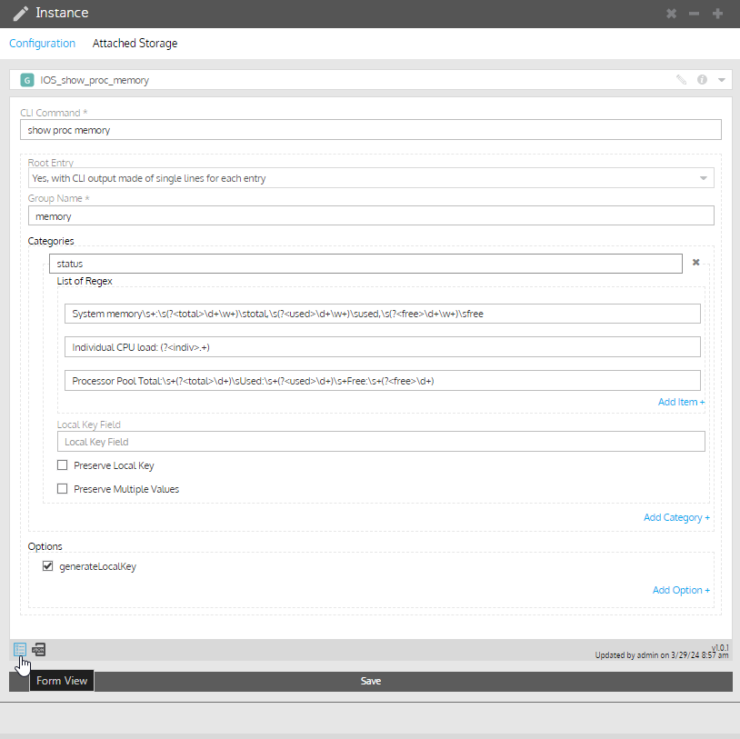
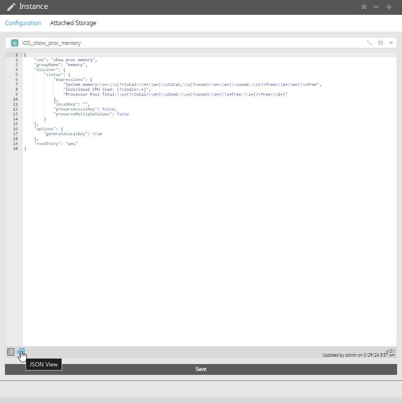
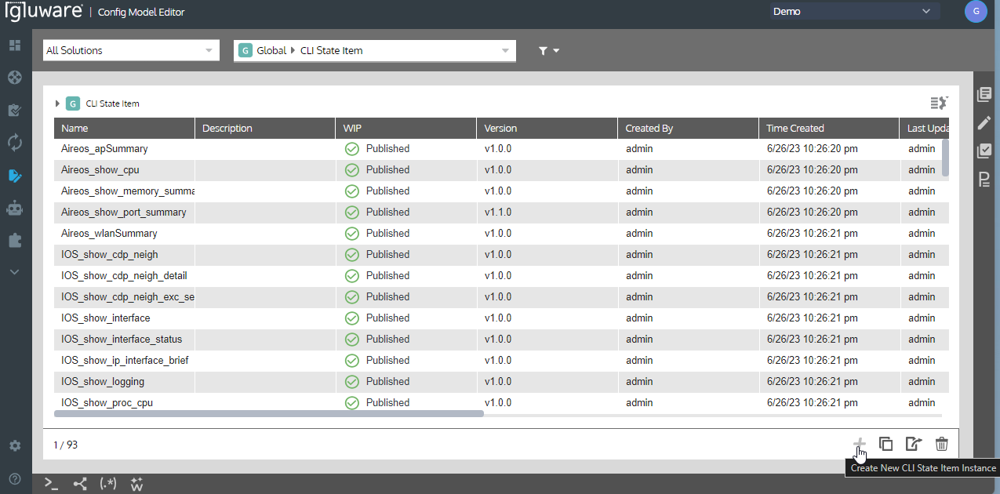
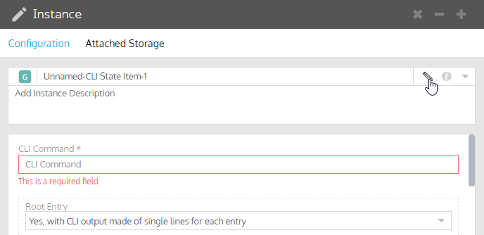

## cliStateItems Folder
These are the CLI State Items for use in Gluware Config Model Editor

## cliStatePolicy Folder
These are the CLI State Policies for use in Gluware Config Model Editor

## cliStateItems Folder
These are the CLI State Queries to run against cliStatePolicies in Gluware Config Model Editor

## Importing Node State Assessment Items Manually
All the Config Modeling instances within Gluware Control are based on a JSON object.  When viewing any Config Modeling instance, a user can toggle between the JSON view and the Form view.  In the example below we show how to toggle these views on a Global CLI State Item.
### Form View:

### JSON View:


The JSON View can be used for quick import of Config Modeling instances when generating a separate capsule may not be necessary.  To import a Config Modeling instance such as a new CLI State Item, do the following:
1. Create a new instance of a CLI State Item by going to Config Modeling > Global > CLI State Item and selecting the + button on the bottom right hand corner. 

1. The new instance should be called "Unnamed-CLI-State Item-#".  Update the name to a user friendly one that users in your organization to find by clicking on the pencil by the name of the instance

1. Click save to update the instance name
1. Toggle to the JSON view of the instance
1. Select the entire JSON object (including the curly braces), and delete the object
1. Paste in the new JSON that you have created in a different Gluware organization or has been provided to you by Gluware employee into the text box. EX:
```json
{
    "cmd": "show cdp neighbors",
    "keyLineRegEx": "^([-\\.a-zA-Z0-9]+)$",
    "groupName": "cdp",
    "discover": {
        "neighbors": {
            "expressions": [
                "(?<deviceId>^[\\w\\d\\-\\.()]+)\\s+(?<localPort>(?:[\\w]+\\s?[\\d\\/\\-\\.]+))\\s+(?<holdtime>\\d+)\\s+(?<capability>[RSDTHCBIMPr\\s]+\\b)\\s+(?<platform>(?:\\b[\\S+]+))\\s+(?<remotePort>(?:[\\w]+\\s?[\\d\\/\\-\\.]+)$)"
            ]
        }
    },
    "options": {},
    "rootEntry": "no"
}
```
1. Click save to update the instance with the new JSON data